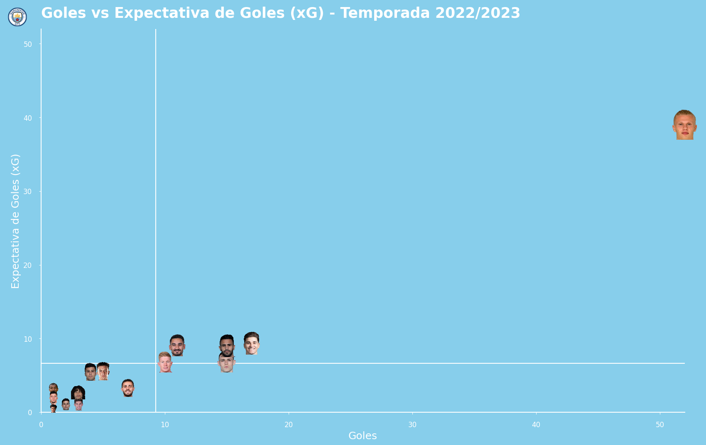

# Manchester City 2022/2023 Performance Analysis



## Objective:

Analyze the performance of Manchester City during the 2022/2023 season, a historic season where the club won the **treble** (Premier League, FA Cup, and UEFA Champions League). The analysis focuses on both team and individual player performance, with a particular emphasis on offensive and defensive metrics.

## Key Analyses:

- **Offensive Metrics**: Analyzed goals scored (GF) and expected goals (xG), comparing players' actual performance against their expected output.
- **Home vs Away Performance**: Compared goals scored, goals conceded, and xG across home and away matches.
- **Defensive Metrics by Position**: Evaluated defensive contributions (tackles, blocks, interceptions) across different player positions.
- **Key Player Comparison**: Highlighted the defensive strengths of key players such as Rodri, Rúben Dias, and Kyle Walker.
- **Defensive Effectiveness in Duels**: Analyzed the success rate of players in defensive duels and the number of challenges attempted.
- **Contributions per 90 Minutes**: Normalized defensive metrics to provide fair comparisons across players with different playing times.
- **Defensive Actions in Different Zones**: Assessed the distribution of defensive actions across the defensive, middle, and attacking thirds of the pitch.
- **Errors and Ball Losses**: Identified which players were most prone to defensive errors and lost challenges.

## Tools and Skills Demonstrated:

- **Pandas**: For data processing, transformation, and analysis.
- **Matplotlib & mplsoccer**: For creating visually engaging scatter plots, bar charts, and soccer-specific visualizations.
- **Image Processing**: Integrated player images in visualizations using `PIL` and `OffsetImage`.
- **Similarity Matching**: Used `difflib` to match player names with their images.
- **Statistical Analysis**: Provided insights through statistical summaries (averages, percentages, etc.).

## Running the Analysis:

To replicate this analysis:

1. Install the necessary packages:
   ```bash
   pip install pandas matplotlib mplsoccer pillow difflib
   ```
2. Load the datasets (FBref and Understat data).
3. Run the provided notebook to generate the visualizations and insights.

To explore the insights:
[View PDF Report](etl.pdf) 
